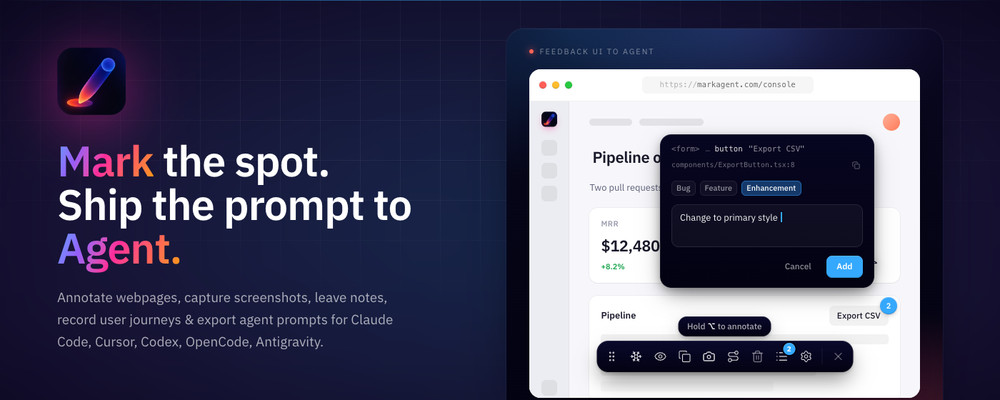

# Markagent

**Web annotator Chrome extension for Claude Code, Cursor, Codex and every AI coding agent.**

Click any element on any webpage, leave a note, and ship a pixel-precise prompt straight to your AI coding agent. No more "this button, that menu, no THAT one."

[**Install from the Chrome Web Store →**](https://chromewebstore.google.com/detail/markagent-uiweb-feedback/hbmbjdgombakndjikfacafdgolofnaag)

[Website](https://markagent.avibebuilder.com) · [Report a bug](../../issues/new?template=bug_report.yml) · [Request a feature](../../issues/new?template=feature_request.yml) · [Buy me a coffee](https://ko-fi.com/petertr)

---

## What is Markagent?

Markagent is a free Chrome extension that turns visual UI feedback into ready-to-paste prompts for AI coding agents.

Press `Cmd+Shift+.` (Mac) or `Ctrl+Shift+.` (Windows/Linux) on any webpage, click the elements you want changed, write what you want, and Markagent exports a clean Markdown prompt for your agent.

Works with **Claude Code, Cursor, Codex, OpenCode, Antigravity, v0, Bolt, Lovable** — and any AI tool that reads text.

## What it does

- **Annotate any webpage** — click elements, leave bug / feature / enhancement notes
- **Capture screenshots** with annotation overlays baked in
- **Record multi-step user journeys** for reproducible bug reports
- **Export agent-ready Markdown** — readable as a bug ticket for humans, executable by AI
- **Pixel-precise selectors** + React component metadata so agents fix the right line of code on the first try

## Why Markagent vs. a screenshot

A screenshot tells your agent "something here." Markagent tells it which element, which file the element came from, what you want changed, and what the surrounding context is — in a format the agent can act on without re-asking.

## Privacy

- 100% local — annotations never leave your browser
- Zero telemetry, no analytics, no tracking
- No account, no paid tier, no upsell
- Works on localhost and authenticated sites

## This repo

Markagent is a **closed-source product** — this repo is the public home for **feedback, bug reports, and feature requests**.

- [**File a bug**](../../issues/new?template=bug_report.yml)
- [**Request a feature**](../../issues/new?template=feature_request.yml)
- [**Request an integration**](../../issues/new?template=integration_request.yml) (new agent / platform support)
- [**See the roadmap**](../../issues?q=is%3Aopen+label%3Aroadmap)
- [**Discussions**](../../discussions)

## Support the project

Markagent is free forever and built by one developer. If it saves you time, [buy me a coffee](https://ko-fi.com/petertr) ☕ — every cup funds the next feature.

## Links

- 🌐 [markagent.avibebuilder.com](https://markagent.avibebuilder.com)
- 🛒 [Chrome Web Store listing](https://chromewebstore.google.com/detail/markagent-uiweb-feedback/hbmbjdgombakndjikfacafdgolofnaag)
- ☕ [Ko-fi](https://ko-fi.com/petertr)

---

Markagent · Web annotation Chrome extension for AI coding agents · © 2026
